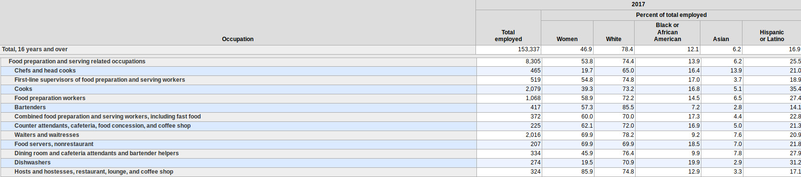

# Cafeteria Supply Chain System


## About

- An application that takes cafeteria data and visualizes customer data trends.
- A software solution to track popularity of dishes to predict the amount of food to order.
- Demographics is cafeteria workers.
- Cafeteria workers who needs something quick, with the most output with minimal input
- Easy to use and implement into a system that already exist.
- Find out what dishes and what days are the most popular dishes.

#### Demographics

A combined of almost a quarter of the workers in the industry are from a Latino
and Asian background.



[Source: Employed persons by detailed occupation, sex, race, and Hispanic or Latino ethnicity](https://www.bls.gov/cps/cpsaat11.htm)

## Setup

Follow the steps from the following link if you don't have `node` or `npm`
installed:

- [How to install NodeJS](https://howtonode.org/how-to-install-nodejs)

Clone the repository:

```
git clone https://github.com/jraleman/jamstack-2018 jamstack-2018_jraleman
cd jamstack-2018_jraleman/
```

Install all the needed dependencies:

```
npm install
```

## Project Structure

### Process Flow Diagram


### Graph Query

```
query dateRange($time_now: DateTime!) {
    allDates(filter: {
        dates Absent_none: {
            from_gte: $time_now - <<1 year>>
            to_lte: $time_now
        }
    }) {
        date
        meal_type
        meal_name
        meal_tags
        num_txn
    }
}
```

## Style-guide

Coming soon :)

## Contributors

- [Gio Aaguirre](https://github.com/its-gio)
- [Joey Chung](https://github.com/jchung05)
- [Jose Ramon Aleman](https://github.com/jraleman)
- [Megan Okerlund](https://github.com/mokerlund)

## License

The project is under the [MIT License](LICENSE).
